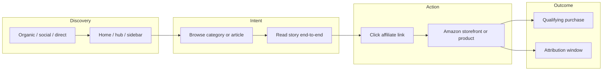
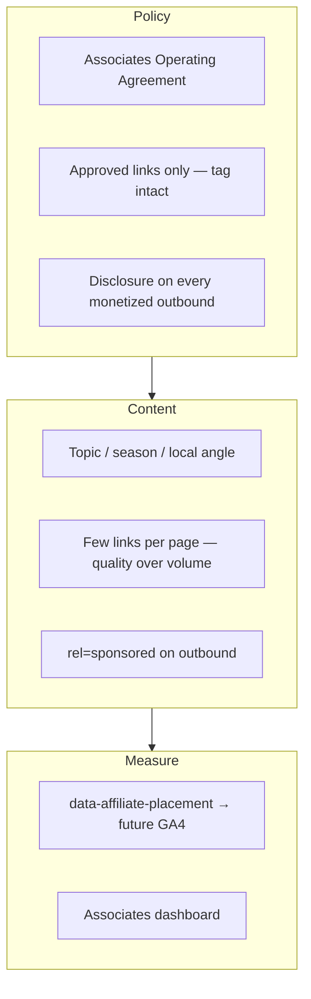
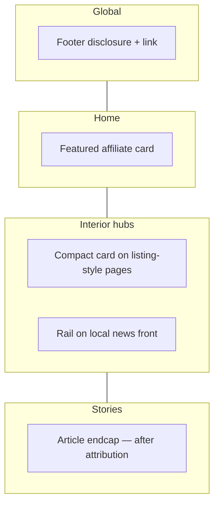

# Amazon Associates — promotion plan (mynanganallur.in)

End-to-end strategy for affiliate links, placements, operations, and measurement.  
**Config:** set `NEXT_PUBLIC_AMAZON_AFFILIATE_URL` to your approved SiteStripe or short link (e.g. in `.env.local` and production env).

---

## 1. Visitor journey

---

## 2. Editorial / ops workflow

---

## 3. Placement map (site)

| Layer | Location | Variant | `data-affiliate-placement` |
|-------|----------|---------|------------------------------|
| Home | After marketplace teaser | `home` | `home-featured` |
| Article | After source block, before related | `compact` | `article-endcap` |
| Local news index | Editor sidebar (or bottom if empty state) | `rail` / `compact` | `hub-local-news` |
| Directory / jobs / events / area / topic | Bottom of main column | `compact` | `hub-*` per route |
| Global | Site footer | `footer` | `footer-global` |

---

## 4. Implementation (code)

| File | Role |
|------|------|
| `src/lib/amazon-affiliate.ts` | `getAmazonAffiliateUrl()` |
| `src/components/affiliate/amazon-affiliate-block.tsx` | All UI variants |
| `src/components/home/home-amazon-affiliate.tsx` | Home re-export |
| `src/app/(public)/page.tsx` | Renders `HomeAmazonAffiliateCard` |
| `src/components/news/editorial-article.tsx` | Article endcap |
| `src/components/site/site-footer.tsx` | Footer strip |
| Hub pages under `src/app/(public)/` | Compact or rail |

If `NEXT_PUBLIC_AMAZON_AFFILIATE_URL` is unset, **no affiliate UI renders** (safe for previews).

---

## 5. Next steps (optional)

- Emit GA4 `affiliate_click` with `placement` from `data-affiliate-placement`.
- Dedicated buying guides (`/guides/...`) with contextual product deep links.
- Newsletter block with the same disclosure pattern.

---

## 6. Route-by-route execution board

| Route | Placement | Variant | Intent type | Status |
|------|-----------|---------|-------------|--------|
| `/` | After marketplace teaser | `home` | Discovery + light intent | Implemented |
| `/local-news` | Right rail (or fallback compact when empty) | `rail` / `compact` | Editorial browse | Implemented |
| `/local-news/[slug]` | Endcap after source attribution | `compact` | High intent (story completion) | Implemented |
| `/local-news/topic/[topic]` | Feed-bottom block | `compact` | Topic intent | Implemented |
| `/directory` | Main column bottom | `compact` | Utility intent | Implemented |
| `/jobs` | Main column bottom | `compact` | Utility intent | Implemented |
| `/local-events` | Main column bottom | `compact` | Utility intent | Implemented |
| `/areas/[slug]` | Main column bottom | `compact` | Area intent | Implemented |
| Global footer | Disclosure + outbound | `footer` | Sitewide trust touchpoint | Implemented |

---

## 7. 90-day rollout (advanced)

### Phase 1 (now): baseline monetization

- Keep one high-clarity affiliate CTA per page section (avoid clutter).
- Maintain explicit disclosure copy and `rel="sponsored"` for outbound links.
- Standardize placement IDs (`data-affiliate-placement`) for analytics joins.

### Phase 2 (next): intent amplification

- Launch one recurring buying-guide lane (monthly): power backup, school essentials, monsoon prep, festival shopping.
- Add contextual deep links in high-time-on-page stories only (max 1-3 per story).
- Add newsletter sponsored block using the same disclosure pattern.

### Phase 3 (then): conversion optimization

- Compare CTA copy variants by placement (`Shop via our link` vs `Continue to Amazon`).
- Test compact card position (before vs after related links on article pages).
- Prune low-performing placements, preserve trust-first editorial UX.

---

## 8. KPI framework

Track each metric weekly and monthly:

- **CTR by placement** = affiliate clicks / page views per `placement`.
- **Qualified order rate** = ordered items / affiliate clicks (from Associates reports).
- **Revenue per 1,000 sessions** by route group (home, hubs, stories).
- **Engagement safety checks**: bounce rate and average engagement time after adding placements.

Use this to make decisions:

- Keep/expand if CTR and revenue/session rise without engagement drop.
- Reposition copy/slot if CTR is low but page engagement is strong.
- Remove or tone down placement if engagement drops materially.

---

## 9. GA4 implementation (live)

`affiliate_click` is emitted on click from any affiliate block with
`data-affiliate-placement`.

### Event payload

- `affiliate_placement` (e.g. `home-featured`, `hub-local-news`)
- `destination_url`
- `destination_host`

### Source files

- `src/components/analytics/google-analytics-affiliate-tracker.tsx`
- `src/components/analytics/site-analytics.tsx`
- `src/components/affiliate/amazon-affiliate-block.tsx`

### Validation checklist

1. Ensure `NEXT_PUBLIC_GA_MEASUREMENT_ID` is set in env.
2. Open site with GA DebugView enabled.
3. Click affiliate CTA on home and one interior page.
4. Confirm `affiliate_click` events and parameter values appear.

---

## 10. Compliance reminder

Keep copy accurate; do not imply editorial endorsement by news authors without a clear “affiliate” label. Follow the current [Amazon Associates](https://affiliate-program.amazon.in/) programme help and Operating Agreement for India.
